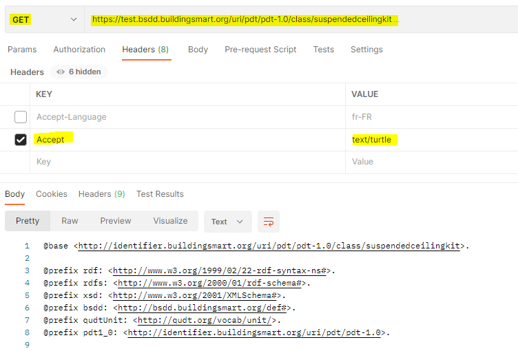

# RDF
リソース記述フレームワーク（RDF）は、Web上でのデータ交換のための標準モデルです。詳細はこちら：https://www.w3.org/RDF/

bSDDには、データをRDF形式で返す機能がありますが、現在は「PREVIEW」ステータスとなっています。

以下のAPIは、RDF形式でのデータ返却に対応しています：

- /api/Classification/v3

キーを"Accept""、値を""application/rdf+xml"とするHTTPヘッダーを追加することで、RDF-XML形式での出力をリクエストできます。

キーを"Accept""、値を""text/turtle""または""application/x-turtle"としたHTTPヘッダーを追加することで、turtle形式での出力をリクエストできます。

