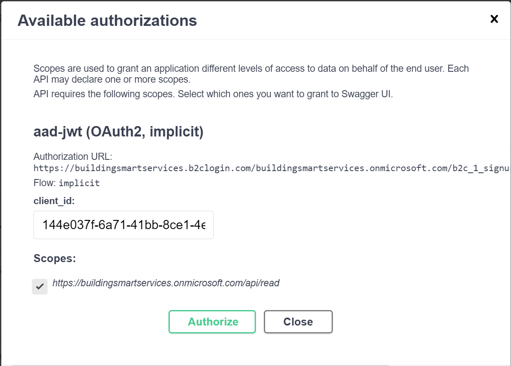
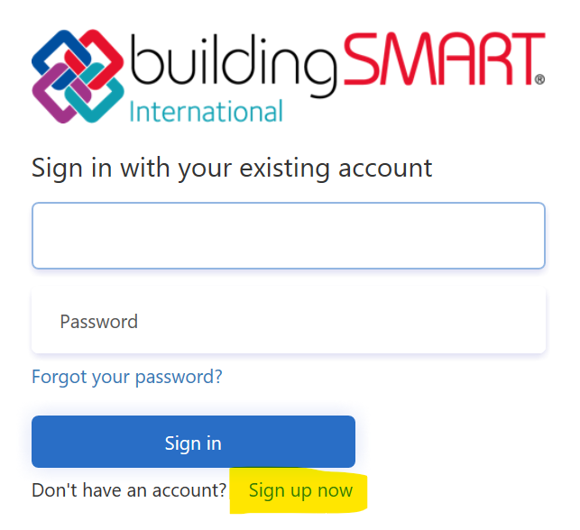

## bSDD API
bSDD API では、IFCや ETIM といった多くの辞書（規格）の`Class`および`Property`取得するためのメソッドが用意されています。その流れの一例は以下の通りです：
* ユーザーが画面を開き、クラスとそのプロパティを検索します
* アプリは起動画面が表示された後、APIの「Dictionary」メソッドを呼び出し、利用可能な辞書のリストを取得します。このリストをユーザーに表示して、選択してもらうことができます。
* ユーザーは辞書を選択し、テキストを入力して必要なクラスを検索します
* ユーザーが「検索」をタップすると、アプリはbSDD APIにリクエスト（「SearchList」メソッド）を送信します。
* その結果、クラスのリストが表示されます
* ユーザーは必要なものを選ぶことができます
* このアプリは、bSDD APIに対して「Class」メソッドを用いて、クラスの詳細およびプロパティに関するリクエストを送信します。
* このAPIはクラスの詳細とプロパティを返し、アプリはそれらをユーザーに表示します

SketchUp では、代表的な使用例が紹介されています。SketchUp の使用例と bSDD プラグインに関する動画は、https://vimeo.com/446417661/ff8b6605d3 でご覧いただけます。

**bSDD API は定期的に更新されています**。API に互換性を損なう変更があった場合、新しいバージョンを作成し、変更が発生してから 6 か月間は両方のバージョンをサポートします。既存の API への機能追加は、通常、互換性を損なう変更には該当しないため、同じバージョンで導入することができます。

## APIの仕様とAPIのテスト
API契約情報は[、「bSDD API契約（公式リリース）」](https://app.swaggerhub.com/apis/buildingSMART/Dictionaries/v1)で確認できます。この情報は、ログインしなくても閲覧可能です。また、APIメソッドのテストも行うことができます。セキュリティ保護されたメソッドには、鍵のマークが付いています。セキュリティ保護されたメソッドにアクセスするには、UI上の「Authorize」ボタンを使用してログインする必要があります：

以下のclient_id を入力してください：b222e220-1f71-4962-9184-05e0481a390d

「read」スコープの確認をお忘れなく！

## https://identifier.buildingsmart.org の使用方法
`Class`や`Property`のデータには、`Class`や`Property`のURIを介して直接アクセスすることもできます。たとえば、ブラウザでhttps://identifier.buildingsmart.org/uri/buildingsmart/ifc/4.3/class/IfcWall にアクセスすると、すると、そのクラスのデータが視覚的に表示されます。出力を JSON 形式にしたい場合は、Accept"ヘッダーに"application/JSON を"指定して送信すると、JSON 形式の結果が返されます。この JSON 結果の内容は、HTML 結果とは異なります！

重要：システム間の通信には、これらの識別子URIを使用しないでください！第一に、サーバー間通信に余分な'ホップ'が追加されてしまいます。第二に、使用されるAPIのバージョンを制御できません。bSDDの新しいリリースが公開された後、その結果はリリース前の結果とは異なる可能性があります。

> 注：https://identifier.buildingsmart.org の URL を直接呼び出して JSON 形式のデータを取得する方法は、現在非推奨となっています。代わりに api/Class/vX または api/Property/vX を使用してください。

## bSDD テスト環境
bSDDには、bSDDの新規開発機能をテストするための'TEST'環境が用意されています。これは本来内部利用を目的としたものですが、bSDDのAPIを利用したい開発者の方は、開発目的でこの'TEST'環境を自由にご利用いただけます。なお、この環境についてはSLA（サービスレベル契約）は設けられておらず、その内容をユーザーに公開することは推奨しておりません。辞書の所有者の方で、データの確認やアップロードプロセスのテストをご希望の場合は、公式のbSDDをご利用ください。

## GraphQL
このデータにはGraphQL経由でもアクセスできます。こちらで試すことができます：[GraphiQL TEST プレイグラウンド](https://test.bsdd.buildingsmart.org/graphiql)。

GraphQLリクエストを送信するURLは次のとおりです：
- 公式リリース：https://api.bsdd.buildingsmart.org/graphqls（セキュリティ対策済み。末尾の"s"にご注意ください）
- テスト版：https://test.bsdd.buildingsmart.org/graphql（セキュリティ対策なし）
- テスト版：https://test.bsdd.buildingsmart.org/graphqls（セキュリティ対策済み）注：これらのURLはハイパーリンクではなく、ブラウザでは機能しません。クエリデータを含むPOSTリクエストを送信する必要があります（GETリクエストでは機能しません）。

ここでは、セキュリティ保護されたbSDD APIにアクセスするためのサンプルコードをご覧いただけます：[bSDD GraphQLのサンプル](bSDD%20and%20GraphQL.md)。実装に関してサポートが必要な場合は、お問い合わせください。
 
## クライアント開発者の皆様へ
### HTTPヘッダー"(X-)User-Agent"
各HTTPリクエストのHTTPヘッダー"User-Agent""（または""X-User-Agent""）に、アプリケーション名とバージョンを記載してください。これにより、bSDDの利用状況をより正確に把握し、bSDD APIをご利用のアプリケーションに関する統計情報を提供することが可能になります。推奨される形式は""アプリケーション名/バージョン""です"。"例："Autodesk.Revit/2024..

### セキュアなAPI
セキュリティ保護されたAPIを使用するクライアントを構築する場合は、クライアントIDを申請する必要があります。申請するには、弊社宛てにメールを送信し、以下の情報を記載してください：
- クライアントアプリケーションの名前
- アプリケーションの種類：
  - Webアプリケーション
  - シングルページアプリケーション
  - iOS / macOS、Objective-C、Swift、Xamarin
  - Android - Java、Kotlin、Xamarin
  - モバイル／デスクトップ
- どの言語を使っていますか？（設定すべきredirectUriは、使用しているライブラリによって異なる場合があります）
- ウェブサイトまたはSPAの場合は、リターンURLを指定してください（ユーザーがログインすると、ログインページからこのURLへリダイレクトされます）。

セキュリティ保護されたAPIは使用しないものの、ウェブサイトやSPAから他のAPIを呼び出したい場合は、CORSを許可するために、お客様のウェブサイトのURLが必要となります。  
セキュリティ対策が施されていないAPIのみを呼び出すデスクトップクライアントを作成する場合は、これで準備は完了です。

### 認証
認証には、Azure Active Directory B2C を使用しています。  
現時点では、認証が必要なメソッドはごくわずかです。ただし、今後状況が変わる可能性があります。

JavaScript、Java、Angular、React、Python、または.NETアプリケーションを開発している場合、buildingSMARTデータディクショナリAPIへの接続は、Microsoft Authentication Library（MSAL）を使用するのが最も簡単です。  
MSAL の使用方法に関するすぐに使える例については、「[Active Directory B2C コードサンプル](https://docs.microsoft.com/en-us/azure/active-directory-b2c/code-samples)」を参照してください。bSDD API 固有の設定については、このドキュメントの後のセクションのいずれかに記載されています。設定は、更新しやすい設定ファイルにまとめておくようにしてください。   
bSDD API（認証済み）にアクセスする小さな .NET コンソールアプリケーションのコードは、このリポジトリ「[.NET コンソールサンプル](../Source%20code%20examples/CSharp-Client-Console-Demo/)」でご覧いただけます。

React: https://docs.microsoft.com/en-us/azure/active-directory/develop/tutorial-v2-react https://github.com/Azure-Samples/ms-identity-javascript-react-tutorial/blob/main/1-Authentication/2-sign-in-b2c/README.md Angular: https://docs.microsoft.com/en-us/azure/active-directory/develop/tutorial-v2-angular-auth-code Java: https://docs.microsoft.com/en-us/samples/azure-samples/ms-identity-java-webapp/ms-identity-java-webapp/ Python: https://docs.microsoft.com/en-us/python/api/overview/azure/active-directory

他の言語を使用して開発を行っている場合でも、bSDD APIはOpenAPI、OAuth2、およびOpenID Connectの標準に準拠しているため、引き続き接続することができます。

セキュリティ保護されたAPIにアクセスするには、ユーザーはまず登録を行う必要があります。MSALを使用する場合、このために特別な操作を行う必要はありません。ユーザーには、ブラウザウィンドウを介してログインするよう促されます。buildingSMART APIのアカウントをお持ちでない場合は、以下から登録できます：

ユーザーは、buildingSMART Azure B2C Active Directoryに登録されます。  
現時点では、このAPIを利用するために追加の認証は必要ありません。

### 設定
これらは、デスクトップクライアントアプリのデモ用に利用できる設定です：
* テナント:"buildingsmartservices.onmicrosoft.com"
* AzureAdB2Chostname:"authentication.buildingsmart.org"
* ClientId:"4aba821f-d4ff-498b-a462-c2837dbbba70"
* RedirectUri:"com.onmicrosoft.bsddprototypeb2c.democonsoleapp://oauth/redirect"
* ポリシー・登録・ログイン:"b2c_1a_signupsignin_c"
* ポリシー編集プロフィール:"b2c_1a_profileedit_c"
* PolicyResetPassword:"b2c_1a_passwordreset_c"

* ApiScope："https://buildingsmartservices.onmicrosoft.com/api/read"
* BsddApiUrl: "https://test.bsdd.buildingsmart.org"

B2Cの完全な権限URLは、https://authentication.buildingsmart.org/tfp/buildingsmartservices.onmicrosoft.com/b2c_1a_signupsignin_cです（tfp"の部分にご注意ください！）。

公式リリース版を使用する場合は、以下の点を除き、上記と同じ設定を使用してください：
* ClientId：[お問い合わせフォーム](https://share.hsforms.com/1RtgbtGyIQpCd7Cdwt2l67A2wx5h)からクライアントIDをリクエストしてください
* RedirectUri：どのようなアプリを開発しているのか、またどの技術を使用しているのかをお知らせください
* ApiScope："https://buildingsmartservices.onmicrosoft.com/bsddapi/read"
* BsddApiUrl: "https://api.bsdd.buildingsmart.org"

bSDD API を使用する Web アプリを開発される場合は、弊社までお知らせください（[お問い合わせフォーム](https://share.hsforms.com/1RtgbtGyIQpCd7Cdwt2l67A2wx5h)）。RedirectURI は Azure AD で設定する必要があります。

### 補足情報
言語に依存しない認証フローの説明：[認証コードフロー](https://docs.microsoft.com/en-us/azure/active-directory-b2c/authorization-code-flow)

さまざまな認証フローの概要：[AD B2C アプリケーションの種類](https://docs.microsoft.com/en-us/azure/active-directory-b2c/application-types)

OAuth 2.0 および OpenID プロトコルの説明：[AD B2C プロトコルの概要](https://docs.microsoft.com/en-us/azure/active-directory-b2c/protocols-overview)
