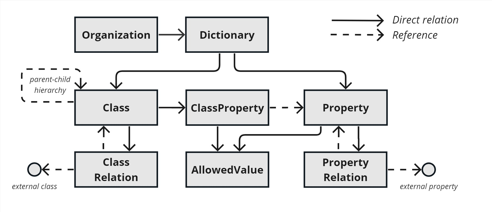
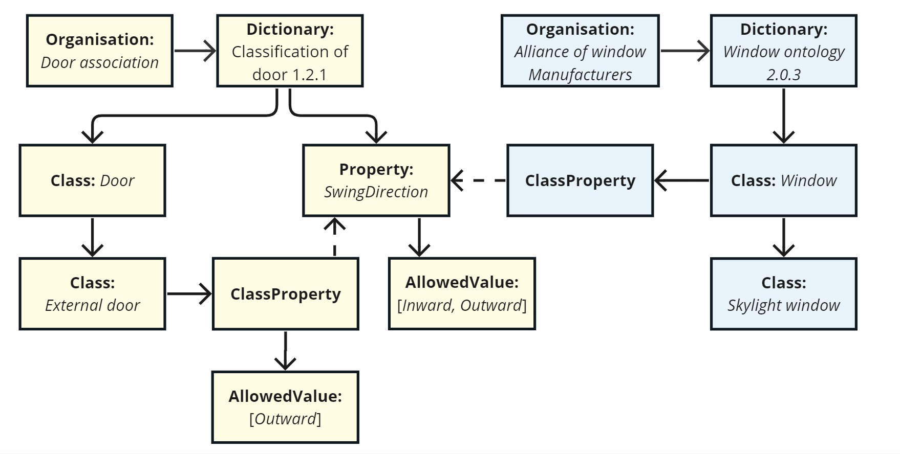
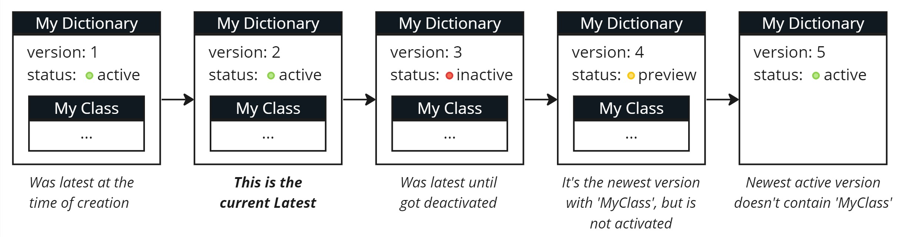

<h2 id="table-of-content">目次</h2>

* [データモデル](#data-model)
* [JSON形式](#json-format)
* [フィールド一覧](#list-of-fields)
    * [辞書](#Dictionary)
    * [クラス](#Class)
    * [プロパティ](#Property)
    * [ClassProperty](#ClassProperty)
    * [クラス関係](#ClassRelation)
    * [許可値](#AllowedValue)
    * [PropertyRelation](#PropertyRelation)
* [補足説明](#additional-explanations)
* [通知](#notifications)


<h2 id="data-model">データモデル</h2>

bSDDは、独立した組織によって公開されたデータディクショナリ（その詳細については後述）の配布を促進するためのサービスです。以下の図は、bSDDの基盤となるデータモデルを簡略化したものです：



上記の概念の使用方法を示す例をご覧ください：[bSDD データの例](graphics/bSDD_data_example.png)：


また、"["果物と野菜"](https://search.bsdd.buildingsmart.org/uri/bs-agri/fruitvegs/1.1)"というデモ用辞書もご用意しています。

📢 最新の技術的な更新情報については、専用フォーラムのスレッドをご覧ください：[https://forums.buildingsmart.org/t/bsdd-tech-updates/4889](https://forums.buildingsmart.org/t/bsdd-tech-updates/4889)

<h2 id="json-format">JSON形式</h2>

buildingSMARTデータディクショナリ用のデータは、本書で説明する当社の標準に準拠したJSONファイルで提供できます。また、JSONおよびExcelのテンプレートは、[/Model/Import Model](../Model/Import%20Model/) 内に用意されています。

リンクをクリックすると、[国](https://api.bsdd.buildingsmart.org/api/Country/v1)、[言語](https://api.bsdd.buildingsmart.org/api/Language/v1)、[単位](https://api.bsdd.buildingsmart.org/api/Unit/v1)、[参照文書](https://api.bsdd.buildingsmart.org/api/ReferenceDocument/v1)、[およびifcクラス](https://api.bsdd.buildingsmart.org/api/Dictionary/v2/Classes?uri=https%3A%2F%2Fidentifier.buildingsmart.org%2Furi%2Fbuildingsmart%2Fifc%2F4.3)について、許可されているコードの一覧を確認できます。  
参照ドキュメントに不足があると思われる場合は、[イシューを投稿して](https://github.com/buildingSMART/bSDD/issues)ご報告ください。JSON内のすべての値は、数値型の「Example」フィールドや「AllowedValue」フィールドを含め、二重引用符で囲まれた文字列でなければなりません。

JSONについてご存じない場合は、[「JSON入門」](https://javaee.github.io/tutorial/jsonp001.html)をお読みになることをお勧めします。なお、JSONはコンピュータシステム間でデータをやり取りするための形式であることにご留意ください。辞書データをコンピュータシステム内に保持している場合は、そのシステムにJSONの作成を任せるのが最善です。

<h2 id="list-of-fields">フィールド一覧</h2>

注：デフォルト値は、フィールドが指定されていない場合にのみ適用されます。フィールドの値を"null に指定した場合、デフォルト値は適用されません。なお、すべてのフィールドで"null を"指定できるわけではないことにご注意ください。

<h3 id="Dictionary">辞書</h3>

`Data dictionary`—*'意味、他のデータとの関係、出所、用途、形式など、データに関する情報を一元的に管理するリポジトリ'*[ISO23386]。'*メタデータを含むデータベース*'[ISO12006-3]。 `Dictionary`（旧称：`domain`）は、`Classes`（旧称：`classifications`）および`Properties`構成されており、これらは互いに、あるいは他の`Dictionaries`関連付けられる可能性がある。各`Dictionary`、以下の表に示すような、それ自体に関する一般的なメタデータが含まれている。

| フィールド | データ型 | 必要ですか？ | 翻訳可能？ | 説明 |
|------------------|------------------|-----------|---------------|------------------------------------------------------------------------------------------------------------------------------------------------------------------------------|
| <span id="OrganizationCode">組織コード</span> | テキスト | ✅ |  | bSDDへの登録時に付与された組織コードです。組織にまだコードがない場合は、[bSDDユーザーヘルプデスク](https://bsi-technicalservices.atlassian.net/servicedesk/customer/portal/3/group/4/create/25)に申請してください。このコードはすべてのURIリンクに表示されるため、できるだけ短いものにしてください。使用可能な文字については、"[コードの形式](#code-format)"のセクションを参照してください。このコードは数字で始まることはできません。コードの例："ifc"。 |
| <span id="DictionaryCode">DictionaryCode</span> | テキスト | ✅ |  | 辞書のコード（できれば短いもの）。例："ifc"。"[コードの形式](#code-format)"の項を参照してください。 |
| <span id="DictionaryName">辞書名</span> | テキスト | ✅\* |  | 辞書の名前。\*辞書がすでに存在する場合、この名前を指定する必要はありません。 |
| <span id="DictionaryVersion">辞書バージョン</span> | テキスト | ✅ |  | 辞書データのバージョン。許可される形式：ドットで区切られた最大3つの数字。例：1.0.1。許可される許容値："12"、"10.1"、"1.2.3"。許可され許容値：例："1.2.3.4"、"Beta"、"2x3"。[セマンティック・バージョニング](https://semver.org/)の手法に従うことを推奨します。 |
| <span id="LanguageIsoCode">言語ISOコード</span> | テキスト | ✅ |  | ISO言語コード：データの言語を示します。複数の言語でデータを提供する場合は、言語ごとに1つのJSONファイルを使用してください。参照リスト[の言語を](https://api.bsdd.buildingsmart.org/api/Language/v1)参照してください。\* 例："de-DE" |
| <span id="LanguageOnly">言語のみ</span> | ブール値 | ✅ |  | JSONに言語固有の情報のみが含まれている場合はtrue、それ以外の場合はfalse \* |
| <span id="UseOwnUri">UseOwnUri</span> | ブール値 | ✅ |  | デフォルト：false。クラスやプロパティをグローバルに一意に識別するために、独自のURIを使用してください。独自のURIを使用しない場合、各`Class` および`Property` |
| <span id="DictionaryUri">DictionaryUri</span> | テキスト | ✅\* |  | UseOwnUri が true の場合、必須です。すべてのクラスおよびプロパティの URI の一部の、グローバルに一意な識別子を指定してください。例："urn:mycompany:mydictionary"または"https://mycompany.com/mydictionary" |
| <span id="License">ライセンス</span> | テキスト |  |  | コンテンツのライセンス識別子。[クリエイティブ・コモンズまたは](https://creativecommons.org/choose/) [OSI承認ライセンスから](https://opensource.org/licenses/)ライセンスを選択することをお勧めします。該当する場合は、標準化[されたSPDX](https://spdx.org/licenses/)識別子を使用して、正規かつ信頼性の高い識別を行う必要があります。例："MIT" "または" "CC-BY-4.0"。参考になるリソースとして、[ChooseALicense.com](https://choosealicense.com/)があります。 |
| <span id="LicenseUrl">LicenseUrl</span> | テキスト |  |  | ライセンスの全文が掲載されているウェブサイトへのリンク。ライセンスページは、指定された"ライセンス"名と一致している必要があります。 |
| <span id="ChangeRequestEmailAddress">メールアドレス変更依頼</span> | テキスト |  |  | ユーザーからの変更依頼を受け取るための単一のメールアドレス。このメールアドレスを提供することにより、ユーザーからの依頼を当社が転送すること、およびAPIを通じて当該メールアドレスを公開することに同意したものとみなされます。お客様は、当社にご連絡いただくことで、この情報の提供を取り消す権利を有します。 |
| <span id="ModelVersion">モデルバージョン</span> | テキスト |  |  | 入力用JSONテンプレートのバージョン番号。 |
| <span id="MoreInfoUrl">詳細情報URL</span> | テキスト |  |  | この辞書に関する詳細情報が掲載されているウェブページのURL |
| <span id="QualityAssuranceProcedure">品質保証手順</span> | テキスト |  |  | 辞書に使用された品質保証手順の名称または簡単な説明。例："ETIM International"、"AFNOR NF XP P07-150 (PPBIM)"、"BSIプロセス"、"UN GHS 2015"、"UN CPC 1.1"、"非公開"、"不明" |
| <span id="QualityAssuranceProcedureUrl">品質保証手順のURL</span> | テキスト |  |  | 品質保証手順に関するより詳細な情報が掲載されているウェブページのURL。例："https://www.buildingsmart.org/about/bsi-process" |
| <span id="ReleaseDate">発売日</span> | 日付と時刻 |  |  | バージョンのリリース日。「[日付と時刻の形式](#datetime-format)」を参照してください。 |
| <span id="Status">ステータス</span> | テキスト |  |  | バージョンステータスの選択肢：`Preview` 、`Active` 、`Inactive` 。新しいバージョンをアップロードする際は、常に`Preview` に設定する必要があります。その後、[APIまたは](https://app.swaggerhub.com/apis/buildingSMART/Dictionaries/v1) [管理ポータル](https://manage.bsdd.buildingsmart.org/)を通じてコンテンツの有効化または無効化を行うことができます。詳細はこちら：[bSDDコンテンツのライフサイクル](bSDD%20import%20tutorial.md#the-lifecycle-of-a-dictionary) |
| <span id="Classes">授業</span> | クラス一覧 | ✅ |  | `Class` 型のオブジェクトの一覧。セクション「[クラス](#class)」を参照してください。 |
| <span id="Properties">プロパティ</span> | 物件一覧 | ✅ |  | `Property` 型のオブジェクトの一覧。セクション「[プロパティ](#property)」を参照してください。 |


\* 他の言語でデータを提供する場合は、 `Dictionary`タイプのフィールド、 `Code`"のすべてのフィールド、およびその他のタイプのフィールドのうち `Translatable?`="Yes"とマークされているフィールドに入力すれば十分です。 `OrganizationCode`の、 `DictionaryCode`、および `DictionaryVersion`が完全に一致していることを確認してください。また、データが既存の"`Dictionary`言語を追加するためのものである場合は、 `LanguageOnly`フィールドをtrue"に設定してください。

<h3 id="Class">クラス</h3>

`Class`-*"同じ特性を共有する一連のオブジェクトの記述"*[ISO23386]。`Class`、任意のオブジェクト（例："壁"、"窓"）、抽象的な概念（例："時間"、"部屋"）、またはプロセス（例："設置"、"分解"）であることができる。


| フィールド | データ型 | 必要ですか？ | 翻訳可能？ | 説明 |
|---------------------------|--------------------------------|-------------|-----------------|--------------------------------------------------------------------------------------------------------------------|
| <span id="Code">コード</span> | テキスト | ✅ |  | 辞書内のクラスを一意に識別するための識別子です。これは、IFCモデルにおいて識別子として使用される情報です。例："abc-00123-01"または"SpecialWall"。コードの検証が適用されます。"[コード形式](#code-format)"を参照してください。接頭辞"Ifc"は、IFC規格用に予約されています。 |
| <span id="Name">名前</span> | テキスト | ✅ | ✅ | `Class,` の例："IfcCurtainWall" |
| <span id="ClassType">クラス種別</span> | テキスト | ✅* |  | 次のいずれかである必要があります：`Class` 、`Material` 、`GroupOfProperties` 、`AlternativeUse` 。[クラスの種類について](#class-types)詳しくは、こちらをご覧ください。指定がない場合は、デフォルトで`Class` タイプが使用されます。`ReferenceDocument` 、`ComposedProperty` 、`Dictionary` の各タイプは非推奨となっており、アップロード時には使用できませんが、移行期間中はAPIの結果に含まれる可能性があります。 |
| <span id="Definition">定義</span> | テキスト |  | ✅ | `Class` の定義と、その意味について解説します。ISO規格では必須項目とされています。[二重角括弧によるリンク](#double-square-bracket-links)に対応しています。 |
| <span id="Description">説明</span> | テキスト |  | ✅ | 補足説明用の追加欄です。*定義が*規格に基づくものであり、さらに説明が必要な場合にのみご利用ください。 |
| <span id="ParentClassCode">親クラスコード</span> | テキスト |  |  | 親データへの参照`Class` 。このフィールドのIDは、提供されるデータ内に存在していなければなりません。例："ifc-00123-00"。["関係の定義方法"](#defining-relations)のセクションを参照してください[。](#defining-relations) |
| <span id="RelatedIfcEntityNamesList">関連するIFCエンティティ名一覧</span> | テキスト一覧 |  |  | この`Class` を表現するために使用するIFCクラスのコード。例：['IfcWall']。 bSDD[APIのifcクラスを](https://api.bsdd.buildingsmart.org/api/Dictionary/v3/Classes?uri=https%3A%2F%2Fidentifier.buildingsmart.org%2Furi%2Fbuildingsmart%2Fifc%2F4.3%2F)参照してください。['関係の定義方法'](#defining-relations)のセクションを参照してください[。](#defining-relations) |
| <span id="Synonyms">同義語</span> | テキスト一覧 |  | ✅ | 検索しやすくするための、このクラスの別名一覧。 |
| <span id="ActivationDateUtc">有効化日時（UTC）</span> | 日付と時刻 |  |  | 「[日付・時刻の形式](#datetime-format)」を参照してください。 |
| <span id="ReferenceCode">参照コード</span> | テキスト |  |  | 参照コードには、辞書固有の用途があります。null の場合、`Code` の値がフィールドに代入されます。`ReferenceCode` を空にするには、空の文字列 を使用してください。 |
| <span id="CountriesOfUse">利用国</span> | テキスト一覧 |  |  | `Class` が使用されている国の ISO コード一覧。参照リスト[の各国を](https://api.bsdd.buildingsmart.org//api/Country/v1)参照してください。 |
| <span id="CountryOfOrigin">原産国</span> | テキスト |  |  | この`Class` の原産国のISO国コード。参照リスト[の各国を](https://api.bsdd.buildingsmart.org//api/Country/v1)参照してください。 |
| <span id="CreatorLanguageIsoCode">作成者言語ISOコード</span> | テキスト |  |  | 作成者の言語のISOコード。参照リスト[の言語を](https://api.bsdd.buildingsmart.org/api/Language/v1)参照してください。 |
| <span id="DeActivationDateUtc">無効化日時（UTC）</span> | 日付と時刻 |  |  | 「[日付・時刻の形式](#datetime-format)」を参照してください。 |
| <span id="DeprecationExplanation">非推奨の理由</span> | テキスト |  | ✅ | 非推奨の定義についてのみ記入してください。 |
| <span id="DocumentReference">ドキュメント参照</span> | テキスト |  |  | `Class` の完全な定義または公式な定義が記載された文書への参照。参照リストの[参照文書を](https://api.bsdd.buildingsmart.org/api/ReferenceDocument/v1)参照のこと。 |
| <span id="OwnedUri">所有Uri</span> | テキスト | ✳️ |  | 辞書レベルで`UseOwnUri = true` を指定した場合は、`Class` をグローバルに一意に識別するURIを指定する必要があります。 |
| <span id="ReplacedObjectCodes">置換されたオブジェクトコード</span> | テキスト一覧 |  |  | このクラスが置き換えるクラスコードの一覧 |
| <span id="ReplacingObjectCodes">オブジェクトコードの置換</span> | テキスト一覧 |  |  | このクラスが置き換えられるクラスコードの一覧 |
| <span id="RevisionDateUtc">改訂日時（UTC）</span> | 日付と時刻 |  |  | 「[日付・時刻の形式](#datetime-format)」を参照してください。 |
| <span id="RevisionNumber">改訂番号</span> | 整数 |  |  |  |
| <span id="Status">ステータス</span> | テキスト |  |  | `Class` のステータス：`Active` （デフォルト）または`Inactive` |
| <span id="SubdivisionsOfUse">用途区分</span> | テキスト一覧 |  | ✅ | 使用地域の一覧例："US-MT" |
| <span id="Uid">Uid</span> | テキスト |  |  | URIだけでは不十分な場合の、一意の識別子（ID）。 |
| <span id="VersionDateUtc">バージョン日付UTC</span> | 日付と時刻 |  |  | デフォルトでは、インポートされた日付が使用されます。「[日付・時刻の形式](#datetime-format)」を参照してください。 |
| <span id="VersionNumber">バージョン番号</span> | 整数 |  |  |  |
| <span id="VisualRepresentationUri">VisualRepresentationUri</span> | テキスト |  | ✅ |  |
| <span id="ClassProperties">ClassProperties</span> | ClassPropertyの一覧 |  |  | 「[ClassProperty](#ClassProperty)」のセクションを参照してください。 |
| <span id="ClassRelations">クラス関係</span> | ClassRelationの一覧 |  |  | 「[ClassRelation](#ClassRelation)」のセクションを参照してください。 |

注：2023年11月のリリース以降、「Materials」は個別に扱われなくなりました。 `Material`のは、現在では単に`Material`型の `Class`扱われます。

<h3 id="Property">プロパティ</h3>

`Property`- '*項目の固有または後天的な特性 [`Class`]。例：熱効率、熱流、(...)、色。'*[ISO23386]。`Properties`、`Classes`割り当てる処理は、[中間オブジェクトであるClassPropertyを通じて](#ClassProperty)行われる。 


| フィールド | データ型 | 必要ですか？ | 翻訳可能？ | 説明 |
|-------------------------------|--------------|-----------|---------------|------------------------------------------------------------------------------------------------------------------------------------------------------|
| <span id="Code">コード</span> | テキスト | ✅ |  | 辞書内のプロパティを一意に識別するための識別子です。これは、IFCモデルにおいて識別子として使用される情報です。例："abc-00123-01"または"ExternalArea"。コードの検証が適用されます。詳しくは"[コード形式](#code-format)"を参照してください。 |
| <span id="Name">名前</span> | テキスト | ✅ | ✅ | 物件名の例："屋外エリア" |
| <span id="Definition">定義</span> | テキスト |  | ✅ | `Property` の定義と、その意味について解説します。ISO規格では必須項目とされています。[二重角括弧によるリンク](#double-square-bracket-links)に対応しています。 |
| <span id="Description">説明</span> | テキスト |  | ✅ | 補足説明用の追加欄です。*定義が*規格に基づくものであり、さらに説明が必要な場合にのみご利用ください。 |
| <span id="DataType">データ型</span> | テキスト | ✅ |  | プロパティが表現されるデータ型。以下のいずれかである必要があります： `Boolean` 、 `Character` 、 `Integer` 、 `Real` 、 `String` 、 `Time` |
| <span id="Units">単位</span> | テキスト一覧 |  |  | 単位コードの一覧。単位とは、値を測定するための尺度を表します（ISO 80000、ISO 4217、またはISO 8601）。[bSDD単位](https://api.bsdd.buildingsmart.org/api/Unit/v1)の参照リスト[（JSON）](https://api.bsdd.buildingsmart.org/api/Unit/v1)または[CSV](../DataFiles/units.csv)形式[の単位表](../DataFiles/units.csv)をご覧ください。[QUDTの](http://www.qudt.org/)単位の多くに対応していますが、もし必要な単位が見つからない場合は、[イシューとして単位のリクエストを投稿してください](https://github.com/buildingSMART/bSDD/issues)。 |
| <span id="Example">例</span> | テキスト |  | ✅ | `Property`の例示値 |
| <span id="ActivationDateUtc">有効化日時（UTC）</span> | 日付と時刻 |  |  | 「[日付・時刻の形式](#datetime-format)」を参照してください。 |
| <span id="ConnectedPropertyCodes">関連プロパティコード</span> | テキスト一覧 |  |  | 1つ以上の関連付けられたプロパティのコードの一覧。別の辞書のプロパティである場合は、コードの代わりに完全なURIを指定することも可能です。「[プロパティの組み立て](#assembling-properties)」を参照してください。 |
| <span id="CountriesOfUse">利用国</span> | テキスト一覧 |  |  | `Property` が使用されている国の ISO コード一覧。参照リスト[の各国を](https://api.bsdd.buildingsmart.org/api/Country/v1)参照してください。 |
| <span id="CountryOfOrigin">原産国</span> | テキスト |  |  | この`Property` の原産国のISO国コード。参照リスト[の各国を](https://api.bsdd.buildingsmart.org//api/Country/v1)参照してください。 |
| <span id="CreatorLanguageIsoCode">作成者言語ISOコード</span> | テキスト |  |  | 作成者の言語のISOコード。参照リスト（JSON）を参照してください。[languages](https://api.bsdd.buildingsmart.org/api/Language/v1) |
| <span id="DeActivationDateUtc">無効化日時（UTC）</span> | 日付と時刻 |  |  | 「[日付・時刻の形式](#datetime-format)」を参照してください。 |
| <span id="DeprecationExplanation">非推奨の理由</span> | テキスト |  | ✅ |  |
| <span id="Dimension">次元</span> | テキスト |  |  | 物理量の場合は、ISO 80000-1で定義されている[国際単位系（SI）](https://en.wikipedia.org/wiki/International_System_of_Quantities)に従って次元を指定してください。順序は、`length` 、`mass` 、`time` 、`electric current` 、`thermodynamic temperature` 、`amount of substance` 、および`luminous intensity` となります。例えば、速度（m/s）は"1 0 -1 0 0 0 0 と表記されます。その他の例については、[IDSのドキュメントを](https://github.com/buildingSMART/IDS/blob/ver/1.0.x/Documentation/UserManual/units.md)参照してください。 |
| <span id="DimensionLength">次元長</span> | 整数 |  |  | 「長さ」の寸法：フィールド「`Dimension` 」を使用してすべての部品を指定するか、すべての部品を個別に指定してください |
| <span id="DimensionMass">次元・質量</span> | 整数 |  |  | 「Mass」の次元：`Dimension` フィールドを使用してすべてのパーツを指定するか、すべてのパーツを個別に指定してください |
| <span id="DimensionTime">DimensionTime</span> | 整数 |  |  | 「時間」次元：`Dimension` フィールドを使用してすべてのパーツを指定するか、すべてのパーツを個別に指定してください |
| <span id="DimensionElectricCurrent">次元・電流</span> | 整数 |  |  | 「ElectricCurrent」ディメンション：フィールド「`Dimension` 」を使用してすべての部品を指定するか、すべての部品を個別に指定してください |
| <span id="DimensionThermodynamicTemperature">次元・熱力学的温度</span> | 整数 |  |  | 「ThermodynamicTemperature」の次元。フィールド「`Dimension` 」を使用してすべての部品をまとめて指定するか、すべての部品を個別に指定してください。 |
| <span id="DimensionAmountOfSubstance">物質量</span> | 整数 |  |  | 「AmountOfSubstance」ディメンション：フィールド「`Dimension` 」を使用してすべての構成要素を指定するか、すべての構成要素を個別に指定してください |
| <span id="DimensionLuminousIntensity">寸法・光度</span> | 整数 |  |  | 「LuminousIntensity」ディメンション：フィールド「`Dimension` 」を使用してすべてのパーツを指定するか、すべてのパーツを個別に指定してください |
| <span id="DocumentReference">ドキュメント参照</span> | テキスト |  |  | `Property` の完全な定義または公式な定義が記載された文書への参照。参照リスト（JSON）[の参照文書を](https://api.bsdd.buildingsmart.org/api/ReferenceDocument/v1)参照してください。 |
| <span id="DynamicParameterPropertyCodes">動的パラメータプロパティコード</span> | テキスト一覧 |  |  | 動的プロパティの関数のパラメータとなるプロパティのコード一覧。[プロパティの組み立てを](#assembling-properties)参照してください。 |
| <span id="IsDynamic">IsDynamic</span> | ブール値 |  |  | デフォルト値：`false` 。これが動的プロパティである場合、その値はフィールド「`DynamicParameterPropertyCodes` 」で指定されたパラメータに依存します。[プロパティの組み立てを](#assembling-properties)参照してください。 |
| <span id="MaxExclusive">最大排他</span> | リアル |  |  | 最大許容値（上限値のみ） - 上限値と下限値の両方を記入しないでください |
| <span id="MaxInclusive">最大包含</span> | リアル |  |  | 最大許容値（上限値を含む）— 上限値と下限値の両方を記入しないでください |
| <span id="MinExclusive">最小排他</span> | リアル |  |  | 許容される最小値（この値は含まない） |
| <span id="MinInclusive">最小包含</span> | リアル |  |  | 許容される最小値（その値を含む） |
| <span id="MethodOfMeasurement">測定方法</span> | テキスト |  | ✅ | 例："ISO 10077-1に基づく熱透過率" |
| <span id="OwnedUri">所有Uri</span> | テキスト | ✳️ |  | 辞書レベルで`UseOwnUri = true` を指定した場合は、`Property` をグローバルに一意に識別するURIを指定する必要があります。 |
| <span id="Pattern">パターン</span> | テキスト |  |  | 許可される値を制限するための[XMLスキーマの正規表現](https://www.regular-expressions.info/xml.html) |
| <span id="PhysicalQuantity">物理量</span> | テキスト |  | ✅ | その特性の物理量の名称。例："なし"、または"質量 |
| <span id="PropertyValueKind">プロパティ値の種類</span> | テキスト |  |  | 次のいずれかである必要があります： `Single` （1つの値；これがデフォルトです）、 `Range` （2つの値）、 `List` （複数の値）、`Complex` （単一値・範囲・リストのいずれにも該当しないもの。例：IfcActorのようなオブジェクト、または接続されたプロパティの集約 -[「プロパティの組み立て」](#assembling-properties)を参照）、`ComplexList` （複合値のリスト）。 |
| <span id="ReplacedObjectCodes">置換されたオブジェクトコード</span> | テキスト一覧 |  |  | `Property` が置き換えるプロパティコードの一覧 |
| <span id="ReplacingObjectCodes">オブジェクトコードの置換</span> | テキスト一覧 |  |  | `Property` が置き換えられるプロパティコードの一覧 |
| <span id="RevisionDateUtc">改訂日時（UTC）</span> | 日付と時刻 |  |  | 「[日付・時刻の形式](#datetime-format)」を参照してください。 |
| <span id="RevisionNumber">改訂番号</span> | 整数 |  |  |  |
| <span id="Status">ステータス</span> | テキスト |  |  | 物件の状況：`Active` （デフォルト）または`Inactive` |
| <span id="SubdivisionsOfUse">用途区分</span> | テキスト一覧 |  | ✅ | 使用地域の一覧例："US-MT" |
| <span id="TextFormat">テキスト形式</span> | テキスト |  |  | テキストタイプ（エンコーディング、文字数）の組み合わせ。エンコーディングは、IANA"のエンコーディング規格名およびRFC"2978に基づいて設定されます。例："（UTF-8,32）" |
| <span id="Uid">Uid</span> | テキスト |  |  | URIだけでは不十分な場合の、一意の識別子（ID）。 |
| <span id="VersionDateUtc">バージョン日付UTC</span> | 日付と時刻 |  |  | デフォルトでは、インポートされた日付が使用されます。「[日付・時刻の形式](#datetime-format)」を参照してください。 |
| <span id="VersionNumber">バージョン番号</span> | 整数 |  |  |  |
| <span id="VisualRepresentationUri">VisualRepresentationUri</span> | テキスト |  | ✅ |  |
| <span id="PropertyRelations">プロパティ関係</span> | PropertyRelationの一覧 |  | ✅ | 関連するプロパティの一覧。セクション「[PropertyRelation](#PropertyRelation)」を参照してください。 |
| <span id="AllowedValues">有効な値</span> | AllowedValueの一覧 |  | ✅ | プロパティの有効な値の一覧。注：ブール型のプロパティにはこれを使用しないでください。「[AllowedValue](#AllowedValue)」のセクションを参照してください。 |


<h3 id="ClassProperty">ClassProperty</h3>

 `Property`、それが記述すべき`Class`に割り当てるための中間オブジェクトです。各「`Class`」複数のプロパティを持つことができ、各 `Property`多くの `Classes`一部の可能性がありますが、1つの `ClassProperty`、常に1つの`Class`と1つの`Property`ペアで構成されます。 

`ClassProperty`を使用すると、 `Class`適用する際、その'プロパティ'の単位、格納すべきプロパティセット、および値の制限を定義することで、プロパティをさらに詳細に指定することができます。例えば、一般的な'温度'は摂氏または華氏で表され、正負いずれの値でも可能ですが、屋内空間に適用する場合、摂氏5度から40度の範囲に制限されることがあります。   


| フィールド | データ型 | 必要ですか？ | 翻訳可能？ | 説明 |
|---------------------|----------|-----------|---------------|------------------------------------------------------------------------------------------------------------------------|
| <span id="Code">コード</span> | テキスト |  |  | `ClassProperty` の一意の識別コードです。コードの有効性チェックが適用されます。詳細は「[コード形式](#code-format)」を参照してください。インポート時に空欄のままにすると、bSDDがランダムなGUIDを生成します。 |
| <span id="PropertyCode">プロパティコード</span> | テキスト | ✅\* |  | `Property` が同じ`Dictionary` にある場合は、そちらを参照してください。\* 2つのうちどちらか一方のみを指定してください。また、PropertyCode を使用している場合は、PropertyUri には何も入力しないでください。 |
| <span id="PropertyUri">PropertyUri</span> | テキスト | ✅\* |  | `Property` が別の`Dictionary` にある場合は、そちらを参照してください。例：[https://identifier.buildingsmart.org/uri/buildingsmart/ifc/4.3/prop/ClearWidth](https://identifier.buildingsmart.org/uri/buildingsmart/ifc/4.3/prop/ClearWidth)\* 2つのうちどちらか一方のみが必要です。また、PropertyUriを使用している場合は、PropertyCodeには何も入力しないでください。 |
| <span id="Description">説明</span> | テキスト |  | ✅ | そのクラス固有のプロパティの説明を指定することができます。指定しない場合は、該当する箇所にそのプロパティの'一般的な'説明が表示されます。 |
| <span id="PropertySet">PropertySet</span> | テキスト |  |  | IFCデータ内で、プロパティを配置すべきセットの名前。このフィールドが空の場合、デフォルトで"undefined_set となります。プレフィックス"Pset_"は、公式のIFC 用に予約されています。コードの検証が適用されます。詳しくは"[コード形式](#code-format)"を参照してください。詳細については、"[プロパティの組み立て](#assembling-properties)"を参照してください。 |
| <span id="Unit">単位</span> | テキスト |  |  | 単位のコード。プロパティ'Units（リスト）とは異なり、この属性は単一の値を取ります。[単位](https://api.bsdd.buildingsmart.org/api/Unit/v1)のリファレンスリスト[（JSON）](https://api.bsdd.buildingsmart.org/api/Unit/v1) [またはCSV形式の単位一覧表](../DataFiles/units.csv)をご参照ください。[QUDTの](http://www.qudt.org/)単位の多くに対応していますが、もし必要な単位が見つからない場合は、[イシューとして単位のリクエストを投稿してください](https://github.com/buildingSMART/bSDD/issues)。 |
| <span id="PredefinedValue">事前定義値</span> | テキスト |  |  | `Property` の事前定義値。例：クラス"IfcWall"では、プロパティ"IsLoadBearing"の値は"true"になる場合があります。 |
| <span id="IsRequired">IsRequired</span> | ブール値 |  |  | これが、`Property` の必須項目であるかどうかを示します。`Class` |
| <span id="IsWritable">IsWritable</span> | ブール値 |  |  | `Class` のこの`Property` の値を変更できるかどうかを示します |
| <span id="MaxExclusive">最大排他</span> | リアル |  |  | 許容される最大値（上限値）。`Property` で定義された値を上書きします。inclusive'と'exclusive'の両方の値を指定しないでください。 |
| <span id="MaxInclusive">最大包含</span> | リアル |  |  | 許容される最大値（上限値を含む）。`Property` で定義された値を上書きします。inclusive'と'exclusive'の両方の値を指定しないでください。 |
| <span id="MinExclusive">最小排他</span> | リアル |  |  | 許可される最小値（除外）。`Property` で定義された値を上書きします。包含'と'除外'の両方の値を指定しないでください。 |
| <span id="MinInclusive">最小包含</span> | リアル |  |  | 許可される最小値（包含）。`Property` で定義された値を上書きします。包含'と'除外'の両方の値を指定しないでください。 |
| <span id="Pattern">パターン</span> | テキスト |  |  | 許可される値を制限するための[XMLスキーマの正規表現](https://www.regular-expressions.info/xml.html)。プロパティに対して定義されたパターンを上書きします。 |
| <span id="OwnedUri">所有Uri</span> | テキスト |  |  | 辞書レベルで`UseOwnUri = true` を指定した場合は、`ClassProperty` をグローバルに一意に識別するURIを指定できます。指定しない場合は、URIが自動生成されます。 |
| <span id="PropertyType">物件タイプ</span> | テキスト |  |  | `Class` 用の`Property` のタイプ：`Property` （デフォルト）または`Dependency` |
| <span id="SortNumber">ソート番号</span> | 整数 |  |  | この「`Property` 」の番号を、以下の範囲内で並べ替える`Class` |
| <span id="Symbol">記号</span> | テキスト |  |  |  |
| <span id="AllowedValues">有効な値</span> | AllowedValueの一覧 |  | ✅ | `ClassProperty` の有効な値の一覧。`Property` で定義された値を上書きします。ブール型のプロパティにはこれを使用しないでください。[「AllowedValue](#AllowedValue)」のセクションを参照してください。 |
| ~~ExternalPropertyUri~~ | ~~テキスト~~ |  |  | 非推奨 - 代わりに ``PropertyUri`、` を使用してください |


<h3 id="AllowedValue">許可値</h3>

`Properties`および`ClassProperties`に対して指定可能な、オプションの値の列挙。たとえば、耐火等級'の場合、許容される値はREI30、REI60、REI90、REI120のわずか数種類に限られる。

| フィールド | データ型 | 必要ですか？ | 翻訳可能？ | 説明 |
|--------------------------|----------|-----------|---------------|-----------------------------------------------------------------------------|
| <span id="Code">コード</span> | テキスト | ✅ |  | コードは、値を一意に識別するためのものです。これは、IFCモデルにおいて識別子として使用される情報です。必須項目であり、ほとんどの場合、値と同じになります。値やその説明の翻訳を可能にするために必要です。コードの検証が適用されます。詳しくは、「[コードの形式](#code-format)」を参照してください。 |
| <span id="Value">値</span> | テキスト | ✅ | ✅ | 値の名前。例："Green"（プロパティ"Color"の場合）。これは主に翻訳用であり、IFCモデルでは使用しないでください。 |
| <span id="Description">説明</span> | テキスト |  | ✅ | 値の説明 |
| <span id="Uri">Uri*</span> | テキスト |  |  | * 所有Uri と機能が重複するため、新しいモデルバージョンでは非推奨となる予定です。 |
| <span id="SortNumber">ソート番号</span> | 整数 |  |  | `Property` の値のリストのうち、その値が属するリストのソート番号 |
| <span id="OwnedUri">所有Uri</span> | テキスト |  |  | 辞書レベルで`UseOwnUri = true` を指定した場合は、`AllowedValue` をグローバルに一意に識別するURIを指定できます。指定しない場合は、URIが自動生成されます。 |

注：`AllowedValue`の翻訳の追加は、現時点ではサポートされていません

<h3 id="ClassRelation">クラス関係</h3>

`Classes`。リレーションにはさまざまな種類があり、階層、構成、類似性、参照などを定義することができます。[「リレーションの定義方法」](#defining-relations)のセクションを参照してください。

| フィールド | データ型 | 必要ですか？ | 翻訳可能？ | 説明 |
|--------------------------|----------|-----------|---------------|-----------------------------------------------------------------------------|
| <span id="RelationType">関係タイプ</span> | テキスト | ✅ |  | 以下のいずれか： `HasMaterial` 、`HasReference` 、 `IsEqualTo` 、 `IsSimilarTo` 、 `IsParentOf` 、 `IsChildOf` 、`HasPart` 、`IsPartOf` 。[関係型](#relation-types)について詳しくは、こちらをご覧ください。 |
| <span id="RelatedClassUri">RelatedClassUri</span> | テキスト | ✅ |  | 関連する`Class` の完全なURI。同じ`Dictionary` でも、別のでもかまいません。例：https://identifier.buildingsmart.org/uri/ETIM/ETIM/8.0/class/EC002987 |
| <span id="RelatedClassName">関連クラス名</span> | テキスト |  |  |  |
| <span id="Fraction">分数</span> | リアル |  |  | `HasMaterial` リレーションにのみ適用されます。リレーションを所有するクラスに適用される総量（例：体積または重量）の割合を任意で指定します。クラス／リレーションタイプごとの割合の合計は1でなければなりません。[IfcMaterialConstituent](http://ifc43-docs.standards.buildingsmart.org/IFC/RELEASE/IFC4x3/HTML/lexical/IfcMaterialConstituent.htm)の「Fraction」と同様です。 |
| <span id="OwnedUri">所有Uri</span> | テキスト |  |  | 辞書レベルで`UseOwnUri = true` を指定した場合は、`ClassRelation` をグローバルに一意に識別するURIを指定できます。指定しない場合は、URIが自動生成されます。 |


<h3 id="PropertyRelation">PropertyRelation</h3>

`ClassRelations`と同様ですが、`Properties`間での関係です。

| フィールド | データ型 | 必須ですか？ | 翻訳可能ですか？ | 説明 |
|--------------------------|----------|-----------|---------------|-----------------------------------------------------------------------------|
| <span id="RelatedPropertyName">関連プロパティ名</span> | テキスト |  |  | 関連する`Property` の名前。 |
| <span id="RelatedPropertyUri">関連プロパティURI</span> | テキスト | ✅ |  | 関連する`Property` の完全なURI。これは、同じ`Dictionary` であっても、別のであってもかまいません。 |
| <span id="RelationType">関係タイプ</span> | テキスト | ✅ |  | `HasReference` 、`IsEqualTo` 、`IsSimilarTo` 、~~IsParentOf、IsChildOf、HasPart~~ のいずれかです。[リレーション型について](#relation-types)詳しくは、こちらをご覧ください。 |
| <span id="OwnedUri">所有Uri</span> | テキスト |  |  | 辞書レベルで`UseOwnUri = true` を指定した場合は、`PropertyRelation` をグローバルに一意に識別するURIを指定できます。指定しない場合は、URIが自動生成されます。 |

---

<h2 id="additional-explanations">補足説明</h2>

<h3 id="code-format">コードの書式</h3>

（2024年4月より）すべてのコードは、発音区別符号、空白、ドット、コンマ、ダッシュ、丸括弧（括弧）、アンダースコア、および数字に対応しています。使用できない特殊文字は、```"#%/\:`{}[]|;<>?~``` です。コードは大文字と小文字を区別しませんが、スモールキャピタルのみの使用を推奨します。 

有効なコードの例としては、"bs-agri"、"apple"、"éÄą _- (Д開発、...żź)" などがあります。

コードは、同じデータディクショナリ内で一意である必要があり、URIの生成に使用されます。

コードの長さの制限は100文字です。

一部のコードは予約されている場合があります。例えば、IFC規格では、プレフィックス'Ifc'および'Pset'で始まるコードが予約されています。 

<h3 id="class-types">クラスの種類</h3>

各クラスには特定の型を指定する必要があります。以下に、ISO 12006-3 に基づく各型の意味について説明します。
* `Class` - 同じ特性を共有する一連のオブジェクトの記述<sup>[ISO12006-3,3.7]</sup>。これはbSDDにおいて最も一般的なタイプである。（例：壁、空間）
* `GroupOfProperties` - プロパティを事前に配置または整理できるようにする集合<sup>[ISO12006-3,3.14]</sup>。例えば、環境プロパティ'など。[プロパティの組み立てを](#assembling-properties)参照のこと。
* `Material` - 物を作るための材料となる物質（例：鉄、ガラス）
* `AlternativeUse` - 他の型では要件を満たせない場合に使用する型。<sup>[ISO12006-3,3.1]</sup>。
   * このクラスタイプは解釈が容易ではないため、ほとんどのソフトウェア実装ではこれを無視していることに注意してください。
* **非推奨** ~~ReferenceDocument - 特定の情報を検索するために参照される出版物。特に技術辞書や科学辞書において用いられる。<sup>[ISO12006-3,3.18]</sup>。参照文書は、データ辞書内に存在するあらゆるデータに関連付けることができる。~~
  * bSDDには、参照用として利用できる最も一般的な規格を含む、[参照文書の](https://api.bsdd.buildingsmart.org/api/ReferenceDocument/v1)グローバルリストがあります。これは、名称が異なるために参照が重複することを防ぐためです。お探しの参照文書が見つからず、リストに追加すべきだとお考えの場合は、[お問い合わせフォームより](https://share.hsforms.com/1RtgbtGyIQpCd7Cdwt2l67A2wx5h)ご連絡ください。
* **非推奨** ~~ ComposedProperty - (...) 複数のプロパティを定義する必要があるフィーチャーに対応する。<sup>[ISO12006-3,3.8]</sup>。~~
  * ~~例：コンクリート仕上げの特性を"記述するには、コンクリートの平坦度、色相、および質感という3つの特性を記述することが必須です。~~
  * 代わりに ``GroupOfProperties`、` を使用してください。

<h3 id="defining-relations">関係の定義</h3>

`ParentClassCode`-`Class`同一の、ツリー状の階層構造で整理することができます。例えば、「IfcPile」は「IfcDeepFoundation」のより具体的なクラスです。 bSDDの用語では、「IfcDeepFoundation」**は**「IfcPile」**の親であると**表現します。このような特化関係を定義するには、子オブジェクトに対して`ParentClassCode`。


`ClassRelation`および`PropertyRelation` これらを使用して、概念同士を関連付けます。関係（Relation）を用いることで、他の辞書との間でも親子関係を定義することができます。特化（specialization）以外にも、分解（decomposition）（`HasPart`型。利用可能な型のリストについては「[Relation types」](#relation-types)を参照）など、他の種類の関係を定義することも可能です。

`RelatedIfcEntityNamesList`-IFC は、ソフトウェア間の情報交換に使用される最上位のスキーマ（基礎クラス）です。そのため、bSDDでは、クラスをIFCに関連付けるための特別な方法が用意されています。`RelatedIfcEntityNamesList`を使用して、IFCのどのエンティティを参照または拡張しているかを示します。例えば、「Signalling LED diode」は、IFC 内の「IfcLamp」に関連付けられています。`RelatedIfcEntityNamesList`、bSDD 関連ツールによって、候補となるクラスのリストを特定のIFCカテゴリに絞り込むために使用できます。

<h3 id="relation-types">関係の種類</h3>

`Properties`、`Classes`、互いに関連付けることができます。ソフトウェアがそれを解釈できるように、各関係には特定の型を指定する必要があります。以下に、各型の意味について説明します。
* <span id='IsEqualTo'>`IsEqualTo`</span> - 2つの概念が曖昧さがなく、名称、コード、定義、説明がすべて同一である場合。また、クラスは同じクラスプロパティを共有している必要があります。概念が完全に一致することは極めて稀です。使用例としては、ある概念に公式の翻訳が存在しないものの、誰かが新しい言語でその概念を含む新しい辞書を定義し、それが元のものと完全に同一であると主張したい場合が挙げられます。（重複した辞書を作成するのではなく、元のデータ辞書への翻訳や改善を提案することを常にお勧めします）。
* <span id='IsSimilarTo'>`IsSimilarTo`</span> - 2つの概念がほぼ同一であるが、名称、コード、定義、説明、またはクラスのプロパティのセットが異なる場合。これは非常に一般的な関係タイプです。例えば、IfcWall'がCCIの'Wall System'と類似した概念であることを示す際に使用されます。このような関係の欠点は、類似性の程度がわからない点にある。つまり、定義の表現がわずかに異なるだけなのか、それとも大きな違いがあるのかが判別できない。
* <span id='HasReference'>`HasReference`</span> - 2つの概念が互いに関連しているものの、他の関係タイプが当てはまらない場合。例えば、"壁灯"（"またはスコンス"）は"壁を参照していますが、これらは異なる概念であり、両者の間には階層関係はありません。
* **非推奨** ~~IsSynonymOf - 2つの概念が明確に区別されるが、名称が異なる場合。~~

クラスにのみ適用されます（プロパティには適用されません）：
* <span id='IsChildOf'>`IsChildOf`</span> - 特殊化関係。"サブタイプ"関係<sup>[ISO12006-3, F3.1]</sup> に相当する。例："電気モーターと "内燃機関は"、総称概念"モーター"の子（サブタイプ）である。
* <span id='IsParentOf'>`IsParentOf`</span> - `IsChildOf` との逆関係。
* <span id='HasPart'>`HasPart`</span> - 構成関係。例えば、電気モーターは、固定子、回転子などの要素で構成されることがある<sup>[ISO 12006-3, F3.2]</sup>。
* <span id='IsPartOf'>`IsPartOf`</span> - `HasPart` の逆。
* <span id='HasMaterial'>`HasMaterial`</span> - 特定の材料に関連付けられるクラス。例："Steel Beam""は""Steel"という材料に関連付けられる。

<h3 id="datetime-format">DateTime 形式</h3>

ISO 8601 シリーズに準拠した日付・時刻形式を使用する必要があります：`YYYY-MM-DDThh:mm:ssTZD`。インポートでは、`2023-05-10`、`2023-05-10T15:10:12Z`、および`2023-05-10T15:10:12+02:00` のいずれも使用可能です。

<h3 id="property-inheritance">財産の相続</h3>

*`Class`→`Class`、`Class`、 `Class`のプロパティを継承していません。作成者が子クラスにも親クラスのプロパティを持たせたい場合は、インポートファイルで意図的にそれらを指定する必要があります。たとえば、[IfcWall](https://search.bsdd.buildingsmart.org/uri/buildingsmart/ifc/4.3/class/IfcWall)は[IfcWallStandardCase](https://search.bsdd.buildingsmart.org/uri/buildingsmart/ifc/4.3/class/IfcWallStandardCase) の親クラスです。[IfcWall には](https://search.bsdd.buildingsmart.org/uri/buildingsmart/ifc/4.3/class/IfcWall) [AcousticRating](https://search.bsdd.buildingsmart.org/uri/buildingsmart/ifc/4.3/class/IfcWall/prop/Pset_WallCommon/AcousticRating) プロパティがありますが、[IfcWallStandardCase](https://search.bsdd.buildingsmart.org/uri/buildingsmart/ifc/4.3/class/IfcWallStandardCase)にはありません。


*`Property`→`ClassProperty`、`ClassProperty`は、特定の`Class`に対する一般的な`Property`インスタンス化です。`AllowedValue`や最小値/最大値の制限など、プロパティの属性は、デフォルトで`ClassProperty` に引き継がれます。`ClassProperty`値は、 `Property`に影響を与えることなく変更できます。例えば、[Heightの上限は](https://search.bsdd.buildingsmart.org/uri/bs-agri/fruitvegs/1.0.0/prop/height)100 cmです。これを"Apple"クラスに適用した場合、[Apple-Height](https://search.bsdd.buildingsmart.org/uri/bs-agri/fruitvegs/1.0.0/class/apple/prop/SizeSet/height)の下限は-25 cmとなります。


<h3 id="latest-version">最新バージョン</h3>

bSDDでは、すべてのリソースに一意の識別子（URI）が割り当てられます。このURIには、その他の情報に加え、組織コード、辞書コード、バージョン番号などが含まれます。例えば、.../**uri/bs-agri/fruitvegs/1.0.0/class/fruit** 特定のリソースを参照したいものの、バージョンが不明な場合や、常に最新バージョンを指したい場合のために、"latest""機能を実装しました。バージョン番号の代わりに""latest"を使用できるようになり、bSDDはそのリソースを含む最新のアクティブ版またはプレビュー版へのリンクを解決します：...**/uri/bs-agri/fruitvegs/latest/class/fruit**。




ぜひお試しください：https://search.bsdd.buildingsmart.org/uri/bs-agri/fruitvegs/latest/class/fruit


⚠️ 最新"の情報は最新のリソースを指しており、新しいバージョンが公開されると変更されます。これは不変のURIではないため、コンテンツが変更される可能性がある点にご注意ください。契約上の取り決めにおいては、特定のバージョン番号を使用することをお勧めします。

<h3 id="assembling-properties">プロパティの組み立て</h3>

**プロパティのグループ**（`Class`を使用。`ClassType`:`GroupOfProperties`）"プロパティを事前に配置または整理することを可能にするコレクション" <sup>[ISO12006-3,3.14]</sup>。bSDDでは、複数のプロパティをグループ化するためのクラスの型として実装されている。

「プロパティのグループ」を使用して、データディクショナリ内のプロパティを整理します。

例：*['LCA指標およびモジュール'](https://search.bsdd.buildingsmart.org/uri/LCA/LCA/3.0)に含まれる['地球温暖化係数'](https://search.bsdd.buildingsmart.org/uri/LCA/LCA/3.0/class/GlobalWarmingPotential)クラスには、'[...総量'](https://search.bsdd.buildingsmart.org/uri/LCA/LCA/3.0/prop/GWP_total)、'[...生物由来'](https://search.bsdd.buildingsmart.org/uri/LCA/LCA/3.0/prop/GWP_biogenic)、'[...化石燃料'](https://search.bsdd.buildingsmart.org/uri/LCA/LCA/3.0/prop/GWP_fossil)、'[...土地利用...](https://search.bsdd.buildingsmart.org/uri/LCA/LCA/3.0/prop/GWP_luluc)'という4つの特性が分類されています*。

**プロパティのセット**（`ClassProperty` を使用。`PropertySet`） - プロパティをグループ化するためのIFC規格に由来する概念。bSDDでは、クラスプロパティに対して定義されたテキストフィールドとして表現され、IFCデータへシリアル化される際に、このクラスプロパティがどのセットに含まれるべきかを指定する。 
  * ISO 16739-1 で定義されている「プロパティセット」とは、プロパティの集合のことですが、プロパティの集合が必ずしもプロパティセットであるとは限りません。
  * プロパティは、複数のプロパティグループに属することができます。ただし、クラスプロパティは、複数のプロパティセットに属することはできません。
  * 接頭辞'Pset_'は、公式のIFC専用に予約されています。

「プロパティセット」を使用して、IFCデータセット内のプロパティの配置場所を定義します。

例：*IfcWall'のプロパティ'Concrete Cover'は、プロパティセット'Pset_ConcreteElementGeneral'に含まれています*。

**関連プロパティ**（`Property`.`ConnectedPropertyCodes` を使用）"現在のプロパティに関連付けられているプロパティの一覧。関連付けは、特殊化または依存関係である。" <sub>[ISO12006-3, 5.3.29]</sub>

あるプロパティの値が別のプロパティの値に依存する場合は、「関連プロパティ」を使用してください。

例： *['地球温暖化係数 - 合計'（GWP）](https://search.bsdd.buildingsmart.org/uri/LCA/LCA/3.0/prop/GWP_total)というプロパティは、製品のライフサイクルの各フェーズごとに定義する必要があります。各段階ごとに個別にプロパティを定義すること（GWP_A1、GWP_A2、…）は望ましくありません。その代わりに、このプロパティは別のプロパティである'[情報モジュール（PHASE）](https://search.bsdd.buildingsmart.org/uri/LCA/LCA/3.0/prop/information_module)'に関連付けられ、18通りの値（A1、A2、C3…）を取ります。 GWP値の意味を解釈するには、{GWP=1.0, PHASE=A1}、{GWP=15.0, PHASE=A3} といった値の組み合わせを参照する必要があります*。 
 

⚠️ この機能はISO規格に由来するものですが、ソフトウェア実装でサポートされていることはほとんどありません。また、IFCでは、1つのプロパティセット内に同名のプロパティを複数定義することはサポートされていません。データディクショナリをより利用しやすくするため、接続プロパティの使用は避けることを検討してください。

**動的プロパティ**（`Property`.`IsDynamic`および .`DynamicParameterPropertyCodes` を使用）"は、動的プロパティの関数のパラメータとなるプロパティである" <sub>[ISO23386, 5.3.29]</sub>。言い換えれば、動的プロパティの値は、`DynamicParameterPropertyCodes`で指定されたプロパティの値に依存する。bSDDには、この式を機械可読な形式で正確に定義するためのフィールドは存在しない。 

「動的プロパティ」を使用して、特定のプロパティの値に影響を与える他のプロパティを確認します。

例：*壁の'面積'は、その'高さ'と'長さ'によって決まり、次の式に従います：A = H × L*。

⚠️ この機能はISO規格に由来するものですが、ソフトウェア実装でサポートされていることはほとんどありません。データディクショナリへのアクセスを容易にするため、動的プロパティの使用を避けることを検討してください。

<h3 id="double-square-bracket-links">二重角括弧のリンク</h3>
二重の角括弧を使用することで、同じ辞書内の他のリソースを参照することができ、プラットフォームがその角括弧を、そのリソースを指すハイパーリンクに置き換えます。クラスとプロパティの両方に同じコードが存在する場合、ハイパーリンクはクラスを指します。コードが見つからない場合は、角括弧は省略されます。 APIは、角括弧付きの定義を返します。 

<h2 id="notifications">通知</h2>

**2023年7月 - 重要なお知らせ：**

> bSDDの継続的な改善の一環として、すべての識別子を更新しました。辞書コードと辞書バージョンの間のダッシュがスラッシュに置き換えられました。例： &gt;  https://identifier.buildingsmart.org/uri/bs-agri/fruitvegs-1.0.0/class/apple は、https://identifier となります。buildingsmart.org/uri/bs-agri/fruitvegs/1.0.0/class/apple &gt; &gt; 辞書コードとバージョンの間にダッシュを使用したデータの提供および取得については、（少なくとも）4か月間は引き続きサポートいたします。ただし、bSDD APIからは新しい形式の識別子のみが返される点にご注意ください。


**2022年8月 - 重要なお知らせ：**

> bSDDでは現在、"http://identifier.buildingsmart.org" "で始まる識別子（"別名URI"）から"、https://identifier.buildingsmart.org "" （"httpから" "https"）への 移行を進めています。これは、これらの識別子をハイパーリンクとして利用しやすくするためでもあります。 &gt; &gt; 従来の"http"識別子の使用は、まもなく非推奨となります！


📢 最新の技術情報については、専用フォーラムのスレッドをご覧ください：https://forums.buildingsmart.org/t/bsdd-tech-updates/4889
