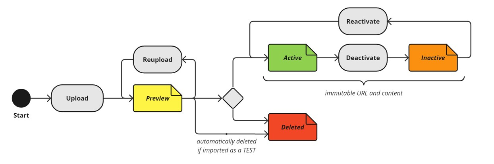

このチュートリアルでは、[bSDD Manageポータル](https://manage.bsdd.buildingsmart.org/)を使用してbSDDコンテンツを公開・管理する方法について説明します。

## 最初の辞書の刊行
<h3 id="register">1. 組織を登録する</h3>

bSDD内の各データディクショナリは、登録済みの組織に代わって公開されています。初めてデータをアップロードする場合は、bSDDに組織を登録し、その組織へのログインに使用したメールアドレスを紐付ける必要があります。そのためには、"[組織登録フォーム](https://bsi-technicalservices.atlassian.net/servicedesk/customer/portal/3/group/4/create/25)"に必要事項をご記入ください。

bSDDの運営業務の一部として、各リクエストを手作業で確認しているため、処理に最大で数日かかる場合があります。返信が届き次第、次のステップに進んでください。

> 組織を登録せずにbSDDを試しに使ってみたいですか？その場合は、DEMO組織に追加させていただきます。この件やその他のご要望については、[お問い合わせフォームより](https://share.hsforms.com/1RtgbtGyIQpCd7Cdwt2l67A2wx5h)ご連絡ください。

<h3 id="prepare">2. コンテンツを準備する</h3>

bSDDへのデータアップロードの主な形式は、適切に構成されたJSONファイルです。[データモデルのドキュメント](https://technical.buildingsmart.org/services/bsdd/data-structure/)では、そのようなファイルに何が含まれるべきか、またどのように構成すべきかを規定しています。

[JSONテンプレートを](../Model/Import%20Model/bsdd-import-model.json)コピーして手動でファイルを作成するか、[Excelテンプレートの説明](../Model/Import%20Model/spreadsheet-import/)に従って作成することができます。あるいは、[bSDDでデータディクショナリを管理・アップロードするためのサードパーティ製ツールの](https://technical.buildingsmart.org/resources/software-implementations/?filter_5=bSDD+submit%2Fmanage&amp;mode=any)いずれかを利用することも可能です。

#### 一般的な指針
- 必要な属性をすべて入力してください。
- コンテンツを分割してアップロードすることはできません。1つの辞書に含まれるすべてのクラスとプロパティは、1つのファイルにまとめておく必要があります。
- 翻訳を別のファイルで管理・公開します。
- 個別の辞書を作成してください。1つの辞書にあまり多くのデータを詰め込もうとしないでください。
- 利便性を高めるため、新しいクラスをIFCエンティティに関連付けます。これにより、ソフトウェアはIFCにおいてそのクラスをどのように表現すべきかを認識できるようになります。
- 既存のプロパティを複製するのではなく、コンテンツに追加してください。
- クラスにプロパティを割り当てる際は、モデル内でどのように構成すべきかが分かるよう、'プロパティセット'名を付けてください（'Pset_'というプレフィックスの使用は避けてください。これはIFCにのみ適用されます）
- 命名規則とガイドライン - 辞書名は一意である必要があります。あまりにも一般的な名前の使用は避けてください。他の辞書と競合する名前も避けてください。たとえば、Ifc'という接頭辞が付いたクラスは作成しないでください。他の辞書からのコンテンツの複製は避けてください。一部のライセンスでは、再配布や改変が許可されていません。コンテンツを自身の辞書にリンクさせることで再利用するのが推奨されます。例えば、他の辞書のプロパティを自身のクラスに追加することができます。
- 辞書コード - 辞書コードはbSDD内で一意である必要があります。辞書名と関連付けられるようなものを選んでください。辞書コードはすべてのリソースのURIを生成するために使用されるため、短く、できればスペースを含まないものにしてください。

**詳しくは** データディクショナリ作成のベストプラクティスについて、**こちらをご覧ください**：[https://technical.buildingsmart.org/services/bsdd/guidelines/](https://technical.buildingsmart.org/services/bsdd/guidelines/)

<h3 id="upload">3. アップロード</h3>

[bSDD Manageポータルに](https://manage.bsdd.buildingsmart.org/)アクセスしてください。まだbSDD buildingSMARTアカウントをお持ちでない場合は、"今すぐ登録""を選択してください。すでにアカウントをお持ちの場合は、""ログイン"を選択してください。

> あるいは、[bSDD API](https://app.swaggerhub.com/apis/buildingSMART/Dictionaries/v1) と連携する[サードパーティ製ツールの](https://technical.buildingsmart.org/resources/software-implementations/?filter_5=bSDD+submit%2Fmanage&amp;mode=any)いずれかを使用して、[bSDD 内のデータディクショナリを管理・アップロードすることもできます](https://technical.buildingsmart.org/resources/software-implementations/?filter_5=bSDD+submit%2Fmanage&amp;mode=any)。

> 注：bSDD Manage ポータルが起動時にエラーを表示する場合、またはローディングアイコンが消えない場合は、Ctrl+F5 キーを押してクッキーを更新してみてください。それでも解決しない場合は、ブラウザの"シークレットモードまたは InPrivate"モードで bSDD Manage ポータルにアクセスしてみてください。それでも解決しない場合は、[お問い合わせフォーム](https://share.hsforms.com/1RtgbtGyIQpCd7Cdwt2l67A2wx5h)よりご連絡ください。

[辞書] タブに移動し、所属する組織を選択してください。所属している組織が 1 つだけの場合は、その組織がすぐにリストに表示されます。

"ファイルを選択"ボタンを使用して、辞書のJSONファイルを読み込んでください。

テストアップロード'オプションを選択することで、ファイルにエラーがないか事前に確認するか、テスト目的でアップロードすることができます。テストアップロードの場合、コンテンツは2ヶ月後にbSDDから自動的に削除され、誤操作を防ぐため、ステータスを'アクティブ'に設定することはできません。

> 注：bSDDを試しに使ってみたいだけという方には、`TEST`アップロードというオプションをご用意しています。`TEST`としてアップロードされたコンテンツは有効化されることはなく、2か月後に自動的に削除されるため、初心者の方にも安心してご利用いただけるオプションです。

"選択したファイルをアップロード"をクリックしてください

インポートを行う際は、その都度、まず'検証のみ？オプションを使用することをお勧めします。これにより、ファイルのインポートを試行することなく、エラーや警告がある場合にその旨が表示されます。

**重要**：既存のファイルと同じバージョン番号の新しいファイルをアップロードすると、そのコンテンツが上書きされます（ただし、ステータスが「`Preview`」の場合に限ります。その他のコンテンツはすべて変更不可です。[詳細は以下をご覧ください](#the-lifecycle-of-a-dictionary)）。

準備が整い、プラットフォームからエラーが返されなかった場合は、""選択したファイルをアップロード""をクリックしてください"。"

ファイルのインポートが完了すると、より詳細なインポートレポートがメールで送信されます。これには最大15分ほどかかる場合があります。インポート処理中にエラーが検出された場合は、その内容がメールに記載されます。

**重要**：アップロードすると、そのコンテンツは一般に公開されます。一般の人々に公開したくないものや、十分な公開許可を得ていないものは、公開しないでください。 

> 注：辞書の閲覧権限を特定のユーザーのみに制限することが可能です。ただし、これはbSDDの有料機能です。[プライベート辞書](https://technical.buildingsmart.org/services/bsdd/private-dictionaries/)について詳しくは、こちらをご覧ください。

> 注：上記で説明したすべての手順は、[bSDD APIとの](https://app.swaggerhub.com/apis/buildingSMART/Dictionaries/v1)連携を利用して自動化することも可能です。

<h2 id="dictionary-lifecycle">辞書のライフサイクル</h2>

bSDDで新しい辞書バージョンを公開すると、最初は常に`Preview`になります。この段階では、コンテンツを**再アップロードして**修正したり、そのバージョンを**有効にしたり**、完全に**削除したり**することができます。

**⚠️ コンテンツが有効化されると、不変のURIが割り当てられます。つまり、そのコンテンツはbSDDに永続的に保存され、削除することはできなくなります**。ステータスを `Inactive`に変更して、使用を中止することを示すことは可能ですが、ページ自体は引き続き存在し、コンテンツも表示されたままとなります。辞書のバージョンを有効化する前に、この点をご考慮ください。

<h2 id="dictionary-reupload">新しい辞書のバージョンを公開する</h2>

初めて公開する場合と同様に、適切な形式のJSONファイルを読み込み、「アップロード」をクリックすることで、辞書の新しいバージョンをアップロードすることもできます。

<h2 id="dictionary-status">辞書のステータスを変更する</h2>

辞書のバージョンを1つ以上アップロードすると、各バージョンの名前、バージョン番号、その他のプロパティが記載された行がテーブルに表示されます。 `action`をクリックすると、JSONファイルをコンピュータに**ダウンロードしたり**、**ステータスを**「`Active`」**に変更したり**、**バージョンを削除したりできます**（これらのオプションは、ステータスが「`Preview`」の場合にのみ利用可能です）。

このオプションを有効にすると、ユーザーは辞書を非公開に設定し、そのコンテンツにアクセスできるユーザーのリストを指定できるようになります。非公開辞書は有料オプションです。詳細については、こちらをご覧ください：[非公開辞書](https://technical.buildingsmart.org/services/bsdd/private-dictionaries/)。

> 注：上記の操作はすべてAPIインターフェースを通じて行うことも可能です。つまり、bSDD APIを実装したサードパーティ製ソフトウェアを使用しても、同じ結果を得ることができます。 
