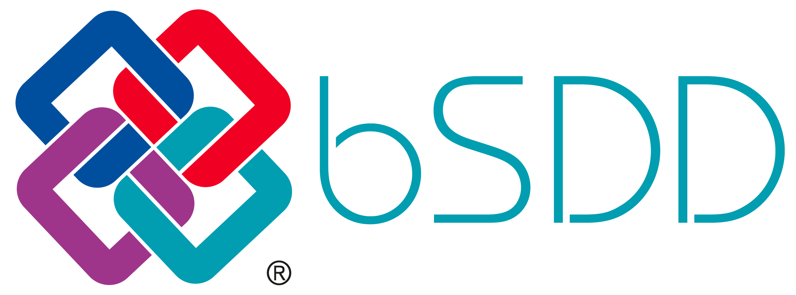

> ## ⚠️ 注意
>
> - buildingSMART が公開している **bSDD リポジトリ** の直下にある **`README.md`** と  
>   **`Documentation/` フォルダ以下の `.md` ファイル** を対象に、 **DeepL API** で機械翻訳した内容を掲載しています。  
> - **現在は試験運用中** につき、翻訳フローやドキュメント内容が今後変更される可能性があります。
> - 翻訳後の日本語リポジトリは、リポジトリ名の先頭に **`bSI_`**、末尾に **`_ja`** を付けて公開しています（例: `bSI_bSDD_ja`）。  
>   ※ 先頭に **`bSI_`** が付いており、末尾に **`_ja`** が付いていないリポジトリは、**翻訳せずコピーのみ** を反映したリポジトリです。  
> - 用語の整合性チェックやレビューは未実施のため、**誤訳や不自然な表現** が含まれる場合があります。  
>   正確な情報が必要な際は、必ず原文もご確認ください。

**bSDD（buildingSMARTデータディクショナリ）**は、分類、その特性、許容値、単位、翻訳などを含むデータ辞書をホストするためのオンラインサービスであり、データ品質と情報の一貫性を向上させるための標準化されたワークフローを提供する。

詳細はbSDDプロジェクトのページhttps://www.buildingsmart.org/users/services/buildingsmart-data-dictionary/。

### 概要

bSDDの中心は、すべての辞書を相互に関連付けることができる正規データベースです。 bSDDにアクセスする主な方法は、その[API（アプリケーション・プログラミング・インターフェース）](https://app.swaggerhub.com/apis/buildingSMART/Dictionaries/v1)ほとんどのBIMソフトウェアやその他のアプリは、このようにしてbSDDに保存されたデータを使用することができます。 それとは別に、次のようなものがあります。[bSDD検索ページ](https://search.bsdd.buildingsmart.org/)著者は、以下の方法でbSDDにコンテンツを公開することができる。[API](https://app.swaggerhub.com/apis/buildingSMART/Dictionaries/v1)または[bSDD 管理ポータル](https://manage.bsdd.buildingsmart.org/)アップロードするには、次の方法で組織を登録してください。[団体登録フォーム](https://bsi-technicalservices.atlassian.net/servicedesk/customer/portal/3/group/4/create/25).

### クイックリンク

* [bSDDプロジェクトページ](https://www.buildingsmart.org/users/services/buildingsmart-data-dictionary/)
* [bSDD検索ページ]()
* [bSDD 管理ポータル]()
* [bSDD API Swagger ページ]()
* [bSDDアップデートフォーラム]()
* [bSDDデータ構造](/Documentation/bSDD%20JSON%20import%20model.md)
* [bSDD JSON テンプレート](/Model/Import%20Model/bsdd-import-model.json)/[bSDDエクセルテンプレート](/Model/Import%20Model/spreadsheet-import)
* [bSDDを統合するツール](https://technical.buildingsmart.org/resources/software-implementations/?filter_5%5B%5D=bSDD%20read%20API&filter_5%5B%5D=bSDD%20submit%2Fmanage&filter_5%5B%5D=bSDD%20IFC%20export%20(including%20URIs)&filter_1=&gv_search=&mode=any)これは自主管理リストなので、足りないものは自由に追加してください。
* [bSDDにデータをアップロードするには？](/Documentation/bSDD%20import%20tutorial.md)

### 開発者向け

📢 予定されている、あるいは最近実施された bSDD のアップデートについては、このフォーラムのトピックでお知らせします：
[bSDD Tech Updates](https://forums.buildingsmart.org/t/bsdd-tech-updates/4889).

* **APIドキュメント**https://github.com/buildingSMART/bSDD/blob/master/Documentation/bSDD%20API.md
* **APIインタラクティブ・ドキュメント**スワガーについて https://app.swaggerhub.com/apis/buildingSMART/Dictionaries/v1

また、以下のサービスも提供している。**テスト**最新機能が最初にロールアウトされ、テストされる環境である。 もしチェックしたいのであれば、ここに同等のページがある（エンドユーザーは使用しないように！）：
* **TEST API ドキュメント**スワガーについて https://test.bsdd.buildingsmart.org/swagger/
* **TEST GraphQL**環境UI：[GraphQL UI](https://test.bsdd.buildingsmart.org/graphiql)
and related Search/Manage pages:
* **TESTサーチ**page: https://search-test.bsdd.buildingsmart.org/
* **テスト管理**ポータル：https://manage-test.bsdd.buildingsmart.org/

## お問い合わせ

ご質問、ご提案がございましたら、お気軽にお問い合わせください：[お問い合わせフォーム](https://share.hsforms.com/1RtgbtGyIQpCd7Cdwt2l67A2wx5h).

bSDDは私たちの活動のひとつです。[戦略的プロジェクト](https://www.buildingsmart.org/about/strategic-projects/)つまり、buildingSMARTインターナショナルは、bSDDの改善のための資金を提供するために、業界のスポンサーを募っているのである。
