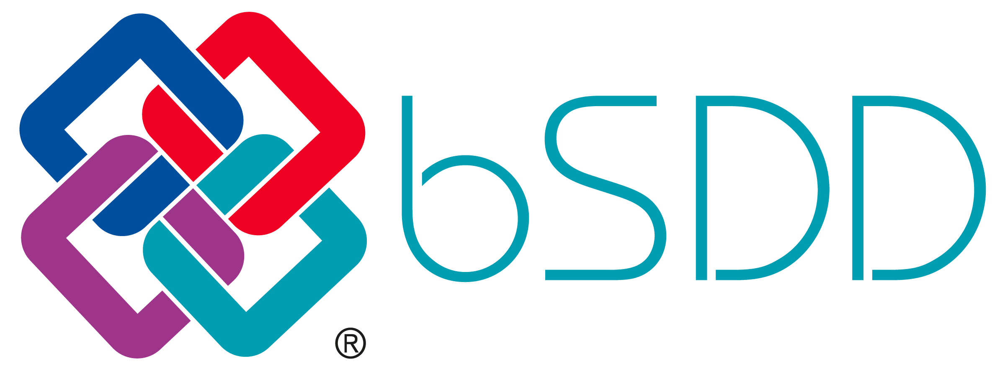

> ## ⚠️ 注意
>
> - buildingSMART が公開している **bSDD リポジトリ** の直下にある **`README.md`** と  
>   **`Documentation/` フォルダ以下の `.md` ファイル** を対象に、 **DeepL API** で機械翻訳した内容を掲載しています。  
> - **現在は試験運用中** につき、翻訳フローやドキュメント内容が今後変更される可能性があります。
> - 翻訳後の日本語リポジトリは、リポジトリ名の先頭に **`bSI_`**、末尾に **`_ja`** を付けて公開しています（例: `bSI_bSDD_ja`）。  
>   ※ 先頭に **`bSI_`** が付いており、末尾に **`_ja`** が付いていないリポジトリは、**翻訳せずコピーのみ** を反映したリポジトリです。  
> - 用語の整合性チェックやレビューは未実施のため、**誤訳や不自然な表現** が含まれる場合があります。  
>   正確な情報が必要な際は、必ず原文もご確認ください。

**buildingSMARTデータディクショナリ（bSDD）は**、分類、そのプロパティ、許容値、単位、翻訳などを含むデータディクショナリをホストするためのオンラインサービスです。データ品質と情報の一貫性を向上させるための標準化されたワークフローを提供します。

詳細はbSDDプロジェクトページをご覧ください：https://www.buildingsmart.org/users/services/buildingsmart-data-dictionary/

### 概要
bSDDの中核をなすのは、すべての辞書を相互に関連付けられる正規データベースです。bSDDにアクセスする主な方法は[、そのAPI（アプリケーション・プログラミング・インターフェース）](https://app.swaggerhub.com/apis/buildingSMART/Dictionaries/v1)を利用することです。これにより、ほとんどのBIMソフトウェアやその他のアプリケーションが、bSDDに保存されたデータを利用できるようになります。そのほか、[bSDD検索ページでは](https://search.bsdd.buildingsmart.org/)、ユーザーがコンテンツを検索することができます。作成者は、[APIまたは](https://app.swaggerhub.com/apis/buildingSMART/Dictionaries/v1) [bSDD管理ポータル](https://manage.bsdd.buildingsmart.org/)を通じてbSDDにコンテンツを公開できます。コンテンツをアップロードするには、[組織登録フォーム](https://bsi-technicalservices.atlassian.net/servicedesk/customer/portal/3/group/4/create/25)を使用して組織を登録してください。

### クイックリンク
* [bSDD プロジェクトページ](https://www.buildingsmart.org/users/services/buildingsmart-data-dictionary/)
* [bSDD 検索ページ](https://search.bsdd.buildingsmart.org/)
* [bSDD 管理ポータル](https://manage.bsdd.buildingsmart.org/)
* [bSDD APIのSwaggerページ]()
* [bSDDのフォーラム更新情報](https://forums.buildingsmart.org/t/bsdd-tech-updates/4889)
* [bSDDデータ構造](/Documentation/bSDD%20JSON%20import%20model.md)
* [bSDD JSONテンプレート](/Model/Import%20Model/bsdd-import-model.json)/[bSDD Excelテンプレート](/Model/Import%20Model/spreadsheet-import)
* bSDD&amp;filter_1=&amp;gv_search=&amp;mode=any を[統合したツール](https://technical.buildingsmart.org/resources/software-implementations/?filter_5%5B%5D=bSDD%20read%20API&filter_5%5B%5D=bSDD%20submit%2Fmanage&filter_5%5B%5D=bSDD%20IFC%20export%20(including%20URIs)。これは自主管理型のリストですので、記載漏れがあればお気軽に追加してください。
* [bSDDにデータをアップロードするには？](/Documentation/bSDD%20import%20tutorial.md)

### 開発者の皆様へ
📢 bSDDの予定されているアップデートや最近実施されたアップデートについては、このフォーラムスレッド「[bSDD Tech Updates](https://forums.buildingsmart.org/t/bsdd-tech-updates/4889)」でお知らせしています。

* **APIドキュメント** [bSDD API](Documentation/bSDD%20API.md)
* **APIインタラクティブドキュメント：** Swagger上の https://app.swaggerhub.com/apis/buildingSMART/Dictionaries/v1

また、最新の機能が最初に導入され、テストが行われる**「TEST」**環境も提供しています。ご確認されたい場合は、以下のページをご覧ください（エンドユーザーの方はご利用にならないでください！）：
* **Swagger上のTEST APIドキュメント**：https://test.bsdd.buildingsmart.org/swagger/
***TEST GraphQL環境のUI**：[GraphQL UI](https://test.bsdd.buildingsmart.org/graphiql)および関連する検索・管理ページ：

* **テスト用検索**ページ：https://search-test.bsdd.buildingsmart.org/
* **TEST 管理**ポータル：https://manage-test.bsdd.buildingsmart.org/

## お問い合わせ
ご不明な点やご提案がございましたら、[お問い合わせフォーム](https://share.hsforms.com/1RtgbtGyIQpCd7Cdwt2l67A2wx5h)よりご連絡ください。

bSDDは当社の[戦略的プロジェクト](https://www.buildingsmart.org/about/strategic-projects/)の一つであり、buildingSMART Internationalは、bSDDの改善に向けた取り組みの実施資金を賄うため、業界各社からのスポンサーシップを募っています。
